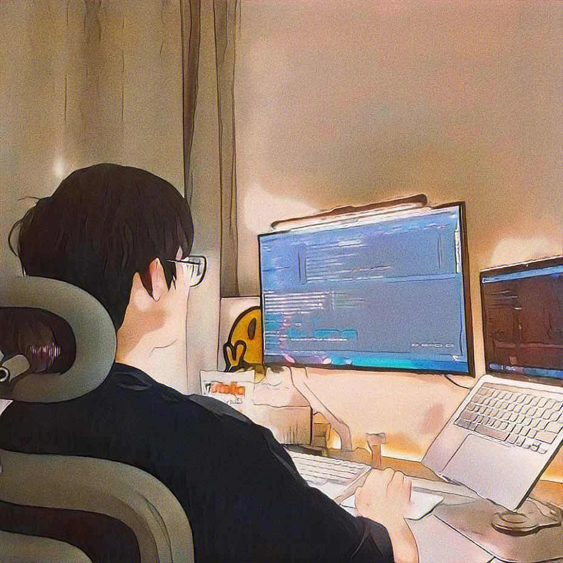
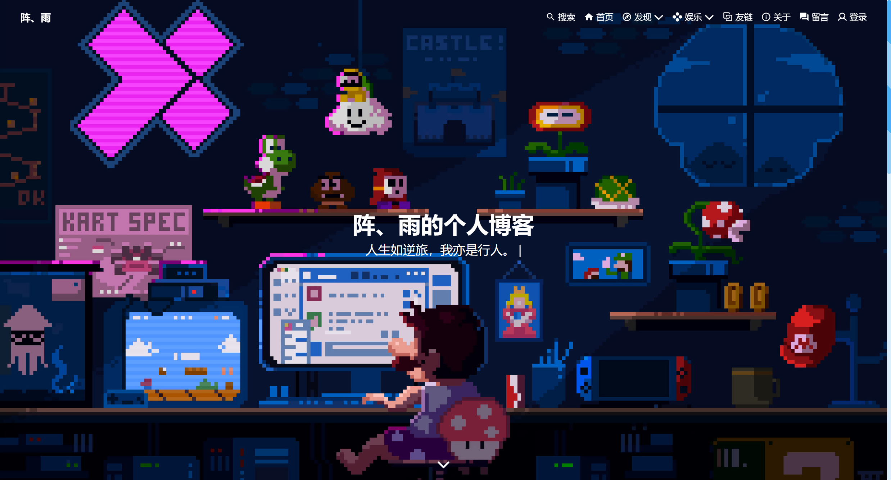
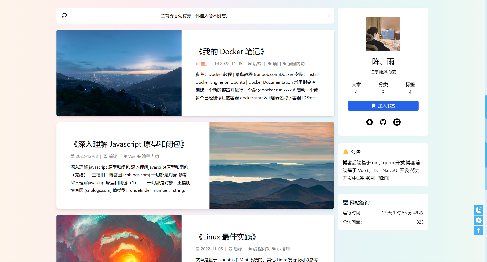
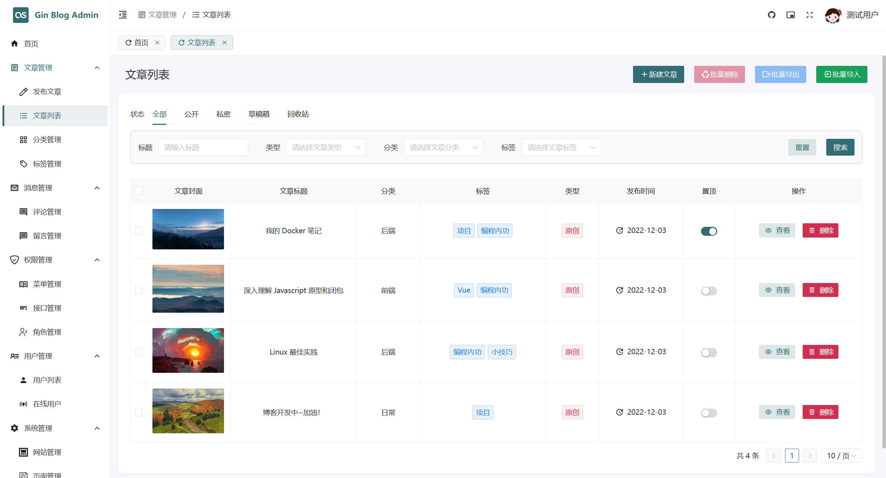

## 博客交流群

2023-12-09：最近项目处于重构中，会经历快速迭代，线上版本不一定是最新，暂时不要上生产环境

2023-12-27: v2 版本重构 初步完成, 从之间的 Java 风格项目改为 Golang 风格, 还有些功能在修补!

2024-11-16: 最近忙于工作, 没怎么更新, 希望有兴趣的同学可以多多维护该项目, 感谢!

项目交流 QQ 群号：777260310

## 博客介绍

<p align=center>
<a href="http://www.hahacode.cn">

</a>
</p>

<p align="center">
   <a target="_blank" href="#">
      
      
      
      
      
      
      
    </a>
</p>

[在线预览](#在线预览) | [项目介绍](#项目介绍) | [技术介绍](#技术介绍) | [目录结构](#目录结构) | [环境介绍](#环境介绍) | [快速开始](#快速开始) | [总结&鸣谢](#总结鸣谢)  | [后续计划](#后续计划)

您的 Star 是我坚持的动力，感谢大家的支持，欢迎提交 Pr 共同改进项目。

Github 地址：[https://github.com/szluyu99/gin-vue-blog](https://github.com/szluyu99/gin-vue-blog)

Gitee 地址：[https://gitee.com/szluyu99/gin-vue-blog](https://gitee.com/szluyu99/gin-vue-blog)

## 在线预览

> PS: 由于云服务器过期, 目前没有在线预览的网址哦







## 有 Docker 环境可一键启动效果

Linux/Mac 可直接运行，Windows 要使用 GitBash 运行（默认终端不能执行 shell）

```bash
git clone https://github.com/szluyu99/gin-vue-blog 
cd gin-vue-blog/deploy
./bootstrap.sh
```

## 项目介绍

Github 上有很多优秀的前后台框架，本项目也参考了许多开源项目，但是大多项目都比较重量级（并非坏处），如果从学习的角度来看对初学者并不是很友好。本项目在以**博客**这个业务为主的前提下，提供一个完整的全栈项目代码（前台前端 + 后台前端 + 后端），技术点基本都是最新 + 最火的技术，代码轻量级，注释完善，适合学习。

同时，本项目可用于一键搭建动态博客（参考 [快速开始](#快速开始)）。

前台：

- 前台界面设计参考 Hexo 的 Butterfly 设计，美观简洁
- 响应式布局，适配了移动端
- 实现点赞，统计用户等功能 (Redis)
- 评论 + 回复评论功能
- 留言采用弹幕墙，效果炫酷
- 文章详情页有文章目录、推荐文章等功能，优化用户体验

后台：

- 鉴权使用 JWT
- 权限管理使用 CASBIN，实现基于 RBAC 的权限管理
- 支持动态权限修改，前端菜单由后端生成（动态路由）
- 文章编辑使用 Markdown 编辑器
- 常规后台功能齐全：侧边栏、面包屑、标签栏等
- 实现记录操作日志功能（GET 不记录）
- 实现监听在线用户、强制下线功能
- 文件上传支持七牛云、本地（后续计划支持更多）
- 对 CRUD 操作封装了通用 Hook

其他：

- 采用 Restful 风格的 API
- 前后端分离部署，前端使用 Nginx，后端使用 Docker
- 代码整洁层次清晰，利于开发者学习
- 技术点新颖，代码轻量级，适度封装
- Docker Compose 一键运行，轻松搭建在线博客

### 技术介绍

> 这里写一些主流的通用技术，详细第三方库：前端参考 `package.json` 文件，后端参考 `go.mod` 文件

前端技术栈: 使用 pnpm 包管理工具

- 基于 TypeScript
- Vue3
- VueUse: 服务于 Vue Composition API 的工具集
- Unocss: 原子化 CSS
- Pinia
- Vue Router 
- Axios 
- Naive UI
- ...

后端技术栈:

- Golang
- Docker
- Gin
- GORM
- Viper: 支持 TOML (默认)、YAML 等常用格式作为配置文件
- Casbin
- Zap
- MySQL
- Redis
- Nginx: 部署静态资源 + 反向代理
- ...

其他:

- 腾讯云人机验证
- 七牛云对象存储
- ...

### 目录结构

> 这里简单列出目录结构，具体可以查看源码

代码仓库目录：

```bash
gin-vue-blog
├── gin-blog-admin      -- 博客后台前端
├── gin-blog-front      -- 博客前台前端
├── gin-blog-server     -- 博客后端
├── deploy              -- 部署
```

> 项目运行参考：[快速开始](#快速开始)

后端目录：简略版

```bash
gin-blog-server
├── api             -- API
│   ├── front       -- 前台接口
│   └── v1          -- 后台接口
├── dao             -- 数据库操作模块
├── service         -- 服务模块
├── model           -- 数据模型
│   ├── req             -- 请求 VO 模型
│   ├── resp            -- 响应 VO 模型
│   ├── dto             -- 内部传输 DTO 模型
│   └── ...             -- 数据库模型对象 PO 模型
├── routes          -- 路由模块
│   └── middleware      -- 路由中间件
├── utils           -- 工具模块
│   ├── r               -- 响应封装
│   ├── upload          -- 文件上传
│   └── ...
├── routes          -- 路由模块
├── config          -- 配置文件
├── test            -- 测试模块
├── assets          -- 资源文件
├── log             -- 存放日志的目录
├── public          -- 外部访问的静态资源
│   └── uploaded    -- 本地文件上传目录
├── Dockerfile
└── main.go
```

前端目录：简略版

```
gin-vue-admin / gin-vue-front 通用目录结构
├── src              
│   ├── api             -- 接口
│   ├── assets          -- 静态资源
│   ├── styles          -- 样式
│   ├── components      -- 组件
│   ├── composables     -- 组合式函数
│   ├── router          -- 路由
│   ├── store           -- 状态管理
│   ├── utils           -- 工具方法
│   ├── views           -- 页面
│   ├── App.vue
│   └── main.ts
├── settings         -- 项目配置
├── build            -- 构建相关的配置
├── public           -- 公共资源, 在打包后会被加到 dist 根目录
├── package.json 
├── package-lock.json
├── index.html
├── tsconfig.json
├── unocss.config.ts -- unocss 配置
└── vite.config.ts   -- vite 配置
├── .env             -- 通用环境变量
├── .env.development -- 开发环境变量
├── .env.production  -- 线上环境变量
├── .gitignore
├── .editorconfig    -- 编辑器配置
```

部署目录：简略版

```
deploy
├── build      -- 镜像构建
│   ├── mysql  -- mysql 镜像构建
│   ├── server -- 后端镜像构建 (基于 gin-blog-server 目录)
│   └── web    -- 前端镜像构建 (基于前端项目打包的静态资源)
└── start
    ├── docker-compose.yml    -- 多容器管理
    └── .env                  -- 环境变量
    └── ...
```

## 环境介绍

### 线上环境

服务器：腾讯云 2核 4G Ubuntu 22.04 LTS

对象存储：七牛云

### 开发环境

| 开发工具                          | 说明                  |
| ----------------------------- | ------------------- |
| Vscode                        | Golang 后端 +  Vue 前端 |
| Navicat                       | MySQL 远程连接工具        |
| Another Redis Desktop Manager | Redis 远程连接工具        |
| MobaXterm                     | Linux 远程工具          |
| Apifox                        | 接口调试 + 文档生成         |

| 开发环境   | 版本   |
| ------ | ---- |
| Golang | 1.19 |
| MySQL  | 8.x  |
| Redis  | 7.x  |

### VsCode 插件

目前推荐安装插件已经写到 `.vscode/extensions.json` 中，使用 VsCode 打开项目会推荐安装。

> 注意，使用 VsCode 打开 gin-blog-admin 和 gin-blog-front 这两个项目，而不是打开 gin-vue-blog 这个目录！

## 快速开始

建议下载本项目后，先一键运行起来，查看本项目在本地的运行效果。

需要修改源码的话，参考常规运行，前后端分开运行。

本项目开发环境是 Linux，如果 Windows 下运行有奇奇怪怪的问题，可以进群交流或提 Issue

### 拉取项目前的准备 (Windows)

如果是 Windows 系统，需要先执行以下指令，否则 Docker 构建过程可能会出 BUG。

或者直接下载 ZIP 而不是通过 git clone 克隆项目。

Linux 和 Mac 不需要进行该操作。

> 原因是该项目开发时基于 Linux，本项目规范使用 lf 换行符。而 Windows 的 git 在自动拉取项目时会将项目文件中换行符转换为 crlf，经过测试，构建过程会产生 BUG。

> docker部署需要把 注册功能(gin-blog-server/internal/utils/email.go)中的GetEmailVerifyURL函数  loaclhost+端口 换成 你的域名

```bash
# 防止 git 自动将换行符转换为 crlf
git config --global core.autocrlf false
```

### 方式一：Docker Compose 一键运行

需要有 Docker 和 Docker Compose 的环境

> 详细运行文档（包含环境搭建）参考：[deploy/README.md](https://github.com/szluyu99/gin-vue-blog/tree/main/deploy)

Linux 下可以正常启动：（Windows 请使用 `GitBash` 进行操作）

```bash
git clone https://github.com/szluyu99/gin-vue-blog 
cd gin-vue-blog/deploy
./bootstrap.sh
```

本地前台访问 [localhost](http://localhost/)

本地后台访问 [localhost/admin](http://localhost/admin)

默认用户：

- 管理员 admin 123456
- 普通用户 user 123456
- 测试用户 test 123456

如果运行遇到问题，请查看详细文章 [deploy/README.md](https://github.com/szluyu99/gin-vue-blog/tree/main/deploy)

### 方式二：常规运行

需要安装 Golang、Node、MySQL、Redis 环境：
 
- Golang 安装参考 [官方文档](https://go.dev/doc/install)

- Node 安装建议使用 [Nvm](https://nvm.uihtm.com/)，也可以直接去 [Node 官网](https://nodejs.org/en) 下载

- MySQL、Redis 建议使用 Docker 安装

> 以下使用 Docker 安装环境，未做持久化处理，仅用于开发和演示

Docker 安装 MySQL：

```bash
# 注意: 必须安装 MySQL 8.0 以上版本
docker pull mysql:8.0

# 运行 MySQL
docker run --name mysql8 -e MYSQL_ROOT_PASSWORD=123456 -p 3306:3306 -d mysql:8.0

# 查看是否运行成功, STATUS 为 Up 即成功
docker ps

# 进入容器, CTRL + D 退出
docker exec -it mysql8 bash
mysql -u root -p123456
```

Docker 安装 Redis：

```bash
docker pull redis:7.0

# 运行 Redis
docker run --name redis7 -p 6379:6379 -d redis:7.0

# 查看是否运行成功, STATUS 为 Up 即成功
docker ps

# 进入容器, CTRL + D 退出
docker exec -it redis7 bash
redis-cli
```

需要先运行后端服务，再运行前端项目，因为很多前端配置由后端动态加载（如菜单等）。

拉取项目到本地：

```bash
git clone https://github.com/szluyu99/gin-vue-blog.git
```

后端项目运行：

```bash
# 1、进入后端项目根目录 
cd gin-blog-server

# 2、修改项目运行的配置文件，默认加载位于 config/config.toml 

# 3、MySQL 导入 gvb.sql

# 4、启动 Redis 

# 5、运行项目
go mod tidy
go run main.go
```

数据库中的默认用户：

- 管理员 admin 123456
- 普通用户 user 123456
- 测试用户 test 123456

前端项目运行： 本项目使用 pnpm 进行包管理，建议全局安装 `pnpm`

```bash
npm install -g pnpm
```

前台前端：

```bash
# 1、进入前台前端项目根目录
cd gin-blog-front

# 2、安装依赖
pnpm install

# 3、运行项目
pnpm dev
```

后台前端：

```bash
# 1、进入后台前端项目根目录
cd gin-blog-admin

# 2、安装依赖
pnpm install

# 3、运行项目
pnpm dev
```

### 项目部署

TODO

## 总结鸣谢

这个项目不管是前端，还是后端，都是花了比较大心血去架构的，并且从技术选型上，都是选择了目前最火 + 最新的技术栈。当然，这也是个人的学习之作，很多知识点都是边学边开发的（例如 Casbin），这个过程中也参考了很多优秀的开源项目，感谢大家的开源让程序员的世界更加美好，这也是开源本项目的目的之一。本项目中仍有很多不足，后续会继续更新。

最后，项目整体代码风格很优秀，注释完善，适合 Golang 后端开发者、前端开发者学习。

 鸣谢项目：

- [https://butterfly.js.org/](https://butterfly.js.org/)
- [https://github.com/qifengzhang007/GinSkeleton](https://github.com/qifengzhang007/GinSkeleton)
- [https://github.com/zclzone/vue-naive-admin](https://github.com/zclzone/vue-naive-admin)
- [https://github.com/antfu/vitesse](https://github.com/antfu/vitesse)
- ...

⭐ 博客后台的前端基于 [vue-naive-admin](https://github.com/zclzone/vue-naive-admin) 进行二开，感谢作者的开源。但是和原项目区别较大，详见 [gin-blog-admin/README.md](https://github.com/szluyu99/gin-vue-blog/tree/main/gin-blog-admin)

> 需要感谢的绝不止以上这些开源项目，但是一时难以全部列出，后面会慢慢补上。

## 后续计划

高优先级: 

- ~~完善图片上传功能, 目前文件上传还没怎么处理~~ 🆗
- 后台首页重新设计（目前没放什么内容）
- ~~前台首页搜索文章（目前使用数据库模糊搜索）~~ 🆗
- ~~博客文章导入导出 (.md 文件)~~ 🆗
- ~~权限管理中菜单编辑时选择图标（现在只能输入图标字符串）~~ 🆗
- 后端日志切割
- ~~后台修改背景图片，博客配置等~~ 🆗
- ~~后端的 IP 地址检测 BUG 待修复~~ 🆗
- ~~博客前台适配移动端~~ 🆗
- ~~文章详情, 目录锚点跟随~~ 🆗
- ~~邮箱注册 + 邮件发送验证码~~ 🆗
- 修改测试环境的数据库为 SQLite3，方便运行

后续有空安排上：

- 黑夜模式
- 前台收缩侧边信息功能
- 说说
- 相册
- 音乐播放器
- 鼠标左击特效
- 看板娘
- 第三方登录: QQ、微信、Github ...
- 评论时支持选择表情，参考 Valine
- 单独部署：前后端 + 环境
- 重写单元测试，目前的单元测试是早期版本，项目架构更改后，无法跑通
- 前台首页搜索集成 ElasticSearch
- 国际化?

其他：

- 写一份好的文档
- 补全 README.md
- 完善 Apifox 生成的接口文档
- ~~一键部署：使用 docker compose 单机一键部署整个项目（前后端 + 环境）~~ 🆗
