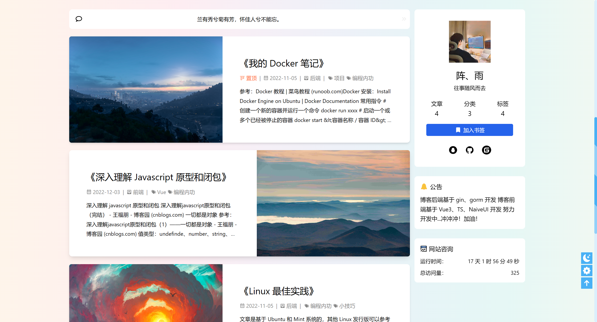
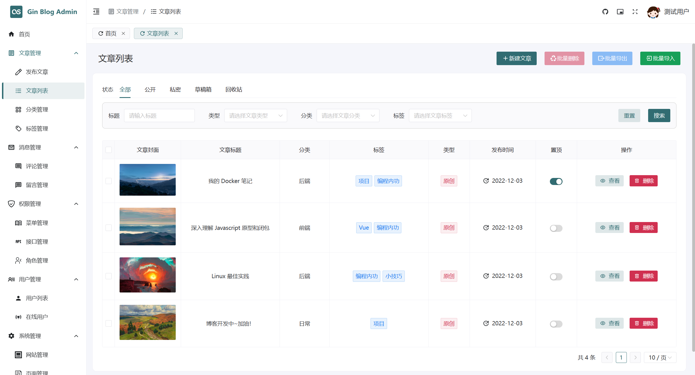

<p align="center">
<a href="https://szluyu99.github.io/gin-vue-blog/">

</a>
</p>

<p align="center">
  
  
  
  
  
  
</p>

一个前后端分离的博客项目：Go + Gin 后端，Vue 3 前台 + Vue 3 后台。代码轻量、注释完善，适合学习全栈开发。

- Github: [szluyu99/gin-vue-blog](https://github.com/szluyu99/gin-vue-blog)
- Gitee: [szluyu99/gin-vue-blog](https://gitee.com/szluyu99/gin-vue-blog)
- 交流 QQ 群: 777260310

欢迎 Star 和 PR。

## 在线预览

纯前端 Mock 数据，不依赖后端，由 GitHub Actions 自动部署：

- 博客前台: <https://szluyu99.github.io/gin-vue-blog/>
- 博客后台: <https://szluyu99.github.io/gin-vue-blog/admin/> （任意账号密码均可登录）
- 接口文档: <https://szluyu99.github.io/gin-vue-blog/api-docs/> （Swagger 注解生成，静态托管无法在线调用）

> 演示数据来自前端内置假数据（`src/mock`），改动仅存在于当前页面，刷新即还原。






## 功能

前台（`gin-blog-front`）：

- 界面参考 Hexo 主题 Butterfly，响应式适配移动端
- 暗色模式：首次访问跟随系统偏好，可手动切换并记住选择，刷新无闪屏
- 文章详情支持目录锚点、推荐文章
- 说说：轻量短内容，支持置顶、公开/私密和评论，首页头部轮播展示最新说说
- 阅读体验：顶部阅读进度条、代码块一键复制、超过 90 天的文章提示内容可能过时
- 文章列表分页（分类 / 标签下同样分页）；首页文章流滚动加载, 提前预取下一页
- 归档按年月分组的时间轴；标签云字号按文章数映射
- 评论 + 回复，留言弹幕墙
- 站内通知：评论被回复 / 自己的文章被评论时头部铃铛提醒，有独立通知页；点通知直接跳到文章里那条评论并高亮（开了评论审核时，在后台点「通过」那一刻才补发通知）
- 点赞、访客统计（在 Redis 里累加，每 10 分钟与退出前落库备份，启动时补回缺的键）
- 用户注册：默认直接建号，可开启邮箱验证码注册（`config.yml` 的 `Captcha.SendEmail`）

后台（`gin-blog-admin`）：

- JWT 鉴权 + 基于角色的权限控制，菜单和接口权限均可在后台动态配置
- 首页仪表盘：待审核评论 / 留言、最新文章、分类分布、访客地域、最近登录、近 14 天访问趋势，接口并行拉取且单个失败不拖垮整页
- 前端菜单由后端下发（动态路由）
- Markdown 文章编辑，支持 `.md` / `.markdown` 导入、`.md` 导出
- 操作日志、登录日志（含失败记录）、在线用户监听与强制下线
- 前端错误日志：前后台的未捕获异常自动上报到后台列表，同类错误按指纹聚合只累加次数（不引 Sentry）
- 用户与角色可禁用：禁用后登录被拒、已签发的 token 立即失效、只靠该角色拿到的权限被收回
- 文件上传支持本地和七牛云
- CRUD 操作封装为通用 Hook

## 技术栈

后端：Go / Gin / GORM / SQLite（默认，可换 MySQL）/ Redis / Viper / `log/slog`

前端：Vue 3 / Vite / Vue Router / Pinia / UnoCSS / VueUse / Axios，后台额外使用 Naive UI，包管理用 pnpm

其他：Docker Compose 一键部署、Nginx 静态资源与反向代理、七牛云对象存储、腾讯云人机验证（可选，默认关闭）

## 目录结构

```bash
gin-vue-blog
├── gin-blog-admin      # 博客后台前端
├── gin-blog-front      # 博客前台前端
├── gin-blog-server     # 博客后端
└── deploy              # Docker 部署
```

后端：

```bash
gin-blog-server
├── cmd                 # 程序入口, 数据初始化脚本
├── internal
│   ├── handle          # 接口处理
│   ├── model           # 数据模型 + 数据库操作
│   ├── middleware      # 中间件
│   ├── global          # 全局配置、错误码
│   └── utils           # 工具方法
├── docs                # Swagger 文档
├── assets              # 资源文件
├── config.yml          # 配置文件
└── Dockerfile
```

前端（两个项目大体一致，后台额外有 `layout`、`composables`）：

```bash
├── src
│   ├── api.js          # 接口
│   ├── assets          # 静态资源（仅后台）
│   ├── components      # 组件
│   ├── mock            # Mock 数据
│   ├── router          # 路由（前台为单文件 router.js）
│   ├── store           # 状态管理
│   ├── utils           # 工具方法
│   └── views           # 页面
├── .env.*              # 环境变量（development / production / mock）
├── uno.config.js       # UnoCSS 配置
└── vite.config.js      # Vite 配置
```

## 快速开始

**本地开发见 [quick_start.md](./quick_start.md)**，含 Mock 模式（不启动后端）和完整启动两种方式、访问地址、默认账号和常见问题。

初始化数据只含系统基础数据（菜单 / 接口 / 角色 / 配置），不含文章。要一批能点得动的内容（分类、标签、15 篇文章、评论与回复、留言、友链）用 `./dev.sh fresh --demo`，或 `cd gin-blog-server/cmd/generate-data && go run main.go -t demo`。

只想看效果，用 Docker Compose 一键运行（需要 Docker + Docker Compose，Windows 请用 GitBash）：

```bash
git clone https://github.com/szluyu99/gin-vue-blog
cd gin-vue-blog/deploy
./bootstrap.sh
```

前台 [localhost](http://localhost/)，后台 [localhost/admin](http://localhost/admin)，默认账号 `admin / 123456`。

详细部署文档见 [deploy/README.md](./deploy/README.md)。

> Windows 下 clone 前建议执行 `git config --global core.autocrlf false`，本项目使用 lf 换行符，crlf 会导致 Docker 构建异常。
>
> Docker 部署若开启了邮箱验证注册（`Captcha.SendEmail: true`），需要把 `gin-blog-server/internal/utils/email.go` 中 `GetEmailVerifyURL` 的 localhost 换成自己的域名。

## 测试与 CI

```bash
cd gin-blog-server && go test ./...   # 后端: model / handle / middleware 层, 8 个包
cd gin-blog-front  && pnpm test       # 前台: vitest, 32 个文件 197 条
cd gin-blog-admin  && pnpm test       # 后台: vitest, 27 个文件 165 条
```

前端测试以回归为主：每条都验证过「把修复回退后会变红」，覆盖的具体缺陷见 `code_audit.md` 的「组件测试」一节。

`.github/workflows/ci.yml` 在 push 和 PR 时跑四组任务：

- Server：`gofmt` / `go vet` / `go test`，并校验 `docs/` 与 Swagger 注解是否一致
- Frontend：两个前端各跑 `pnpm lint` / `pnpm test` / `pnpm build`
- Docker：构建 web 与 server 镜像并启动做健康检查。web 镜像直接用 Frontend job 的产物 + `deploy/build/web/Dockerfile`（不在容器里重新打包前端），server 镜像走 buildx + GitHub Actions 缓存。main 有新提交时，冒烟测试通过后把两个镜像推到 GHCR（`latest` 与 `main-<短 sha>`）
- Deploy：起完整的 compose 栈，校验权限种子数据的不变式（admin 能改配置、guest 不能、未登录被拦，重复执行不新增资源）

## 后续计划

完整的规划与「为什么不做某些事」见 [roadmap.md](./roadmap.md)，下面是概览。

功能：

- 前台「相册」页目前是「禁止访问」占位页（`views/entertainment/album`），导航里两个入口都还在
- 前台侧边信息收缩
- 说说的图片支持（第一版只做纯文本 + 评论，图片要一起解决存储与缩略图）
- 通知定位目前靠前端逐页加载找目标评论，评论量大了要后端补一个「按评论 id 算页码」的接口

工程：

- 注册链接携带明文密码、邮件模块的日志与 TLS（`code_audit.md` 的 S6、S7）——只在启用邮件注册时成立，当前配置没开，暂缓
- 部署侧改成拉 GHCR 镜像（CI 已经在发布，但 compose 仍是本地 `build:`）
- 拆分 `gin-blog-front` 和 `gin-blog-admin` 为独立仓库
- 完善接口文档

明确不做的（理由见 [roadmap.md](./roadmap.md)）：ElasticSearch 搜索、SSR / SSG、第三方登录、国际化、RSS / sitemap、后端日志切割、把 `@iconify/vue` 换成 UnoCSS 图标类。
